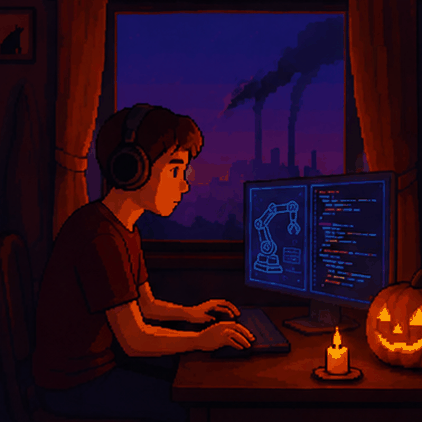

  

# 
 Hi! I am Srijito Ghosh 

### Tech Stack:

### About Me:
- I am a 3rd Computer Science and Engineering undergraduate student at the University Insitute of Technology, The University of Burdwan.
- My current work involves reading and understanding seminal research work in the field of Generative AI and Robotics, while trying to implement them from scratch and making them adapt to my hardware and institutional infrastructure constraints. Such constraints make searching for efficiency not just an option but rather a requirement.

## Brief on what I have worked on:
I had started with building basic image classifiers in the senior year of high school, post which I moved onto using APIs in my first year, but realised that architectural understanding is what interests me the most. This made me start reading research articles and their related blog-posts by the end of my second year examinations.
My considerable projects include:
    - Building a CLIP-based VQA (Visual Question Answering) model, with everything from the image and text encoder being implemented from scratch.
    - Building a Behavioral Cloning agent from scratch and testing it on the Udacity self-driving simulator. This involved manually collecting equal laps of data by driving both in the clock-wise and anti-clockwise directions to cancel out the left-turn bias in the data from the default set-up, and creating an action adapter for a Resnet-18 backbone to predict steering and throttle values.

<!--
**Srijito354/Srijito354** is a ✨ _special_ ✨ repository because its `README.md` (this file) appears on your GitHub profile.

Here are some ideas to get you started:

- 🔭 I’m currently working on ...
- 🌱 I’m currently learning ...
- 👯 I’m looking to collaborate on ...
- 🤔 I’m looking for help with ...
- 💬 Ask me about ...
- 📫 How to reach me: ...
- 😄 Pronouns: ...
- ⚡ Fun fact: ...
-->
